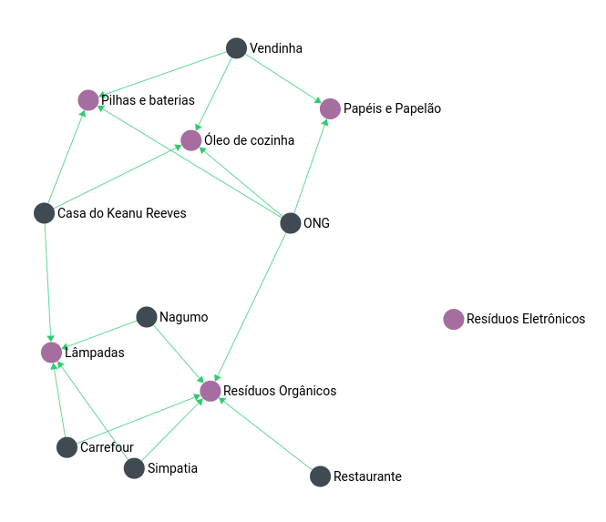

# Ecoleta

## Projeto
Sistema para cadastro/consulta de pontos de coleta de materiais recicláveis,
feito durante a Lext Nevel Week #01, um evento online da Rocketseat em homenagem a semana do meio ambiente.

## Stack
- [Backend](/server) : `Typescript` +  `Node.js `
- [Frontend Web](./web_react) : `React`
- [Frontend Mobile](./mobile) : `React Native` + [Expo](https://expo.io/)

## Diferenciais

### Database

[ArangoDB](https://www.arangodb.com/) : Um database baseado em chave/valor, documentos e  grafos.

Modelar os pontos de coleta e itens em forma de grafo permitiu, *através da interface web do BD*, visualmente tirar insights a respeito do ecossistema criado com a aplicação, tudo isso feito em * poucos minutos* e sem necessidade de nenhuma dependência extra.

## How To

### Database
1. Iniciar o database `docker-compose up`

2. Criar o usuário da aplicação `curl --header "Content-Type: application/json" --request POST --dump - --data '{"user":"lnw","passwd":"lnw"}' http://localhost:8529/_api/user`

### Backend
Entrar na pasta do projeto `cd server` e seguir as [instruções](/server)

### Front Web
Entrar na pasta do projeto `cd web_react` e seguir as [instruções](/web_react)

### Mobile
Entrar na pasta do projeto `cd mobile` e seguir as [instruções](/mobile)

## Ideias de próximos passos
- [ ] Dockerizar todo o ambiente de dev
- [ ] Hardening de segurança
- [ ] Fazer deloy em um cloud provider
- [ ] Implementar o backend no [Deno](https://deno.land/) e fazer testes de performance

---

## whoami
> Murillo Cesar Bianconi

Você pode me achar no [Linkedin](https://www.linkedin.com/in/mcbianconi/), nas redes sociais como @mcbianconi ou através do meu [email](mailto:murillo.ianconi@gmail.com)

