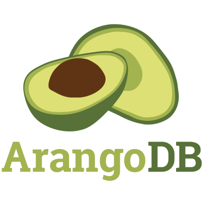

# Next Level Week #01

## Backend

- Instalar as dependências: `yarn install`
- Iniciar o servidor: `yarn prod`

## Debug @ VSCode
Adicionar a configuração abaixo no `launch.json`
```
        {
            "type": "node",
            "request": "launch",
            "name": "Backend",
            "skipFiles": [
                "<node_internals>/**"
            ],
            "program": "${workspaceFolder}/server/src/server.ts",
            "preLaunchTask": "tsc: build - server/tsconfig.json",
            "outFiles": [
                "${workspaceFolder}/server/build/**/*.js"
            ]
        }
```
